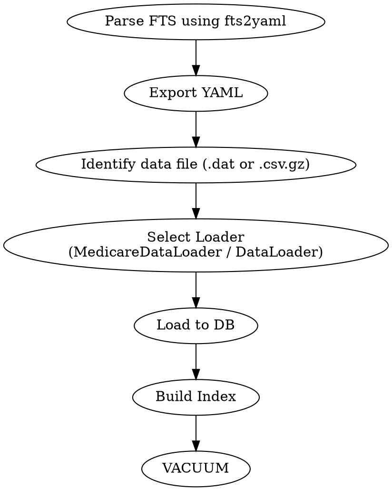

# Medicare: Building a Data Warehouse from ResDac Files

```{toctree}
---
maxdepth: 4
hidden:
---
members/mcr_sas2yaml.rst
members/mcr_sas2db.rst
members/fts2yaml.rst
members/medicare_yaml.md
MedicareLineage.md
Medicaid.md
```


```{contents}
---
local:
---
```

## Processing pipeline
                                      
### Medicare Pipeline Steps

Current pipeline consists of 5 steps, each represented as a sub-workflow:

1. [Ingest raw data](pipeline/load_raw_medicare)
2. [Process beneficiaries and their enrollment in Medicare](pipeline/medicare_beneficiaries)
3. [Process Admissions](pipeline/medicare_admissions)
4. [Create QC Tables](pipeline/medicare_qc)
5. [Grant `SELECT`](pipeline/grant) 
   privileges (i.e., read access) to all newly created tables
   (this step is actually a command line tool, not a workflow)
                                   
### Ingestion of raw data

Ingestion of raw data is incremental, i.e. tables that are already in 
the database
will not be dropped (deleted). However, any table with the name found
in input path will be replaced. Please note, that every raw record
is identified by the tuple consisting of the original file name and
the line number in that file.
                                   
```{note}
If no raw data is given or `--input` parameters points
to a non-existent or empty directory, the pipeline will skip ingestion
step and will process the raw data that is already in the database. 
```
                                                             
Ingestion as a part of the data pipeline is only implemented for
data in the format as it comes from ResDac. Metadata for ingestion
is taken from [FTS](../../../fts) files that accompany ResDac deliverables. 

```{important}
In case of Medicare data in posession of NSAPH organization, we 
only have original ResDac data for years 2011-2014 and 2016-2018. 
Therefore, the pipeline is unable to ingest the data for other years
(1999-2010 and 2015).
```
See [](#files-for-1999-to-2010) for more information.

See [](#ingesting-raw-files) for processing details

### Processing Data in the Database
                                               
During in-database processing all tables, views and materialized views 
are completely replaced. Old tables are dropped and new ones are created
from scratch.

See [](#combining-raw-files-into-a-single-view) for processing details.
                      
### Medicare Pipeline References

See [](pipeline/medicare) for the pipeline code

See [Medicare data model definition](members/medicare_yaml.md) for formal
data model definition.

## Ingesting Raw Files

[Pipeline](pipeline/load_raw_medicare)

### Overview of Ingesting Raw Medicare Files 
                                                                   
There are two types of tables:

* Patient summary, aka enrollment, aka denominator
* Inpatient admissions

Unfortunately, the structure of medicare files is different for 
almost every year. 

Summary files for some years come in pairs:

* `mbsf_ab_summary`
* `mbsf_d_cmpnts`

For other years we have a single file:

* `mbsf_abcd_summary`
                                                                   
Inpatient admissions files always follow `medpar_all_file` pattern.

Columns vary from year to year even for similarly named files, 
new columns are being added and column names are sometimes changed.

To add insult to injury, for years prior to 2011 (1999-2010) we do not 
have original files, but preprocessed files with patient summary 
(called denominators) and admissions. They are in SAS 7BDAT format,
however columns are also different for different years. Please
refer to [Files for 1999 to 2010](#files-for-1999-to-2010) section
for details.

### Storing raw data in the Database

Given the difference in file structures we create a separate table
for every file. However, to make it easier to join these tables we:

* Add a column containing original file name to every table
* Add generated columns with uniform names for:
  * Year
  * State
  * Bene_Id 
  * Zip code

Originally, these data is stored in columns with the following possible names:

    "bene_id":  (None, ["bene_id", "intbid", "qid", "bid_5333*"]),
    "state":  (None, ["state", "ssa_state", "state_code",
                      "bene_rsdnc_ssa_state_cd", "state_cd",
                      "medpar_bene_rsdnc_ssa_state_cd"]),
    "zip": (None, ["zip", "zipcode", "bene_zip_cd", "bene_zip",
                   "bene_mlg_cntct_zip_cd",
                   "medpar_bene_mlg_cntct_zip_cd"]),
    "year": (None, ["year", "enrolyr", "bene_enrollmt_ref_yr",
                    "rfrnc_yr"])
    
When a table has no natural primary key (admission tables) we add a record 
number column. This column ha sno meaning but allows to trace a record to the 
original data.

(files-for-1999-to-2010)=
### Files for 1999 to 2010 

Between 1999 and 2010, original Medicare ResDAC raw datasets are not available 
to NSAPH. Instead, only partially preprocessed files provided by external 
collaborators are available. These have been stored historically on RCE in two
separate directories:

* denominator/
* inpatient/

Each directory contains one file per year. These files use the SAS7BDAT
format, which is a binary data format native to
SAS analytics software. Each file embeds metadata about its schema 
(i.e., field names, types, order), but column names
and formats still vary from year to year.

To handle this variation:

* Each file is individually introspected using the SAS Introspector. 
* A YAML schema is automatically generated and stored in a central
  registry.
* This schema is then used to create the appropriate database table for
  ingestion.

For more details on implementation:

* See the [SAS Inrospector](members/mcr_sas2yaml.rst)  for how
metadata is extracted. 
* See the class [SAS Data Laoder](members/mcr_sas2db.rst) for how
these files are ingested into the database.

Because of schema variability:

* Special heuristics are used to detect core fields like beneficiary ID (
  bene_id), year, zip code, and state code, based
  on a list of possible alternative names.
* Missing expected columns (e.g., year) are sometimes generated using
  information inferred from directory or file naming.

Each resulting table includes:

* A standardized structure with additional generated columns (e.g., record
  ID, file name).
* Uniform field naming conventions to support unioning across years.
* Consistent indexing to support later join operations with downstream
  tables (e.g., beneficiaries and admissions).

> ⚠ Note: Because of the variability and limited provenance of these
files, this step is distinct from the ResDAC
ingestion workflow and is not based on FTS metadata.

📚 Related References:

:doc: members/mcr_sas2yaml for introspection logic
:doc: members/mcr_sas2db for database file loading

### Files for Years 2011 and later

#### Metadata Extraction
                      
These files are original files from ResDac. They come in Fixed Width Format
(FWF) typically using the .dat extension. Each data file 
delivered by ResDAC is accompanied 
by a plain-text metadata file known as a File Transfer Summary (FTS), 
which describes the structure of the corresponding data file—including:

* Column names
* Data types (e.g., NUM, CHAR, DATE)
* Column widths and formats
* Record and file length metadata

These FTS files are designed primarily for human readability 
and are not machine-friendly. To address this, 
the Dorieh includes a partial FTS parser:

👉 [fts2yaml module](members/fts2yaml.rst)

This parser performs the following:

* Extracts structured metadata directly from .fts files
* Converts it to a standardized YAML-based data model. 
  * The YaML model describes table and column definitions.
  * The YaML model includes types, column widths, descriptions,
    and indexing hints
* Supports both Medicare and Medicaid FTS formats

Once the YAML schema is generated, it is used for:

* Generating SQL DDL scripts to create staging tables
* Feeding column layout metadata to the FWF reader (FWFReader)
* Automatically identifying and indexing key fields such as:
  * BENE_ID (Beneficiary ID)
  * YEAR
  * STATE
  * ZIP
  
##### Supported File Types

The parser supports:

* Medicare files: identified based on prefixes like mbsf_abcd_XXXX.fts
* Medicaid files: using filenames like maxdata_ps_STATE_YEAR.fts

#### Ingestion process

Once metadata extraction is complete, raw data ingestion 
takes place using:

* [MedicareDataLoader](members/mcr_data_loader) 
   to parse FWF records row-by-row
* [MedicareLoader](members/mcr_fts2db) to coordinate:
  * FTS parsing
  * Schema registration
  * Loader selection (DAT or CSV)
  * Data loading, indexing, and optimization (VACUUM)

The MedicareLoader module orchestrates the end-to-end process, including:

* Scanning input directories recursively for *.fts files
* Parsing each FTS file to generate a schema
* Locating the corresponding *.dat (or *.csv.gz) files
* Triggering the appropriate file loader
* Writing data to the database



```{mermaid}
graph TD;
    A[.fts file] --> B[YAML schema via fts2yaml]
    B --> C[Extract layout for fixed-width reader]
    C --> D[Run MedicareLoader]
    D --> E[Pick MedicareDataLoader or generic DataLoader]
    E --> F[Load data to SQL table]
    F --> G[Apply indexing and VACUUM]
```

#### Directory Layout Expectation

To function correctly with the NSAPH ingestion pipeline, 
the directory layout for ResDAC raw files must follow this structure:
```
project_root/
└── medicare/
    └── 2018/
        ├── mbsf_abcd_2018.fts
        ├── mbsf_abcd_2018.dat
        └── medpar_2018.fts
```

Specifically:

* Each year must have its own directory
* Table names are inferred from FTS file name and containing year
* The FTS filename must match the .dat or .csv.gz data file (just differing in extension)

💡 For a full example of metadata schema outputs, see:

[Generated Medicare data model](members/medicare_yaml)                 

## Combining raw files into a single view

[Pipeline](pipeline/medicare_beneficiaries)

### Eventual database schema

Once all raw files are ingested into the database they are combined 
into two views:

1. Patient summary (aka MBSF, aka Beneficiary summary)
2. Inpatient Admissions (aka hospitalizations, aka medpar)

The figure below visualizes the database schema. 

```{image} medicare-db.png
---
width: 600
---
```

The tables above are defined in
[Medicare data model definition](members/medicare_yaml.md). This file
uses [](DataModellingExtensions.md).
                                                
### CWL workflows

The 
[full pipeline](pipeline/medicare) consists of two steps:

1. Creating [beneficiary federated summary and enrollments table](pipeline/medicare_beneficiaries)
2. Creating [inpatient admissions table](pipeline/medicare_admissions)
  

### Creating Federated Patient Summary

The federated patient summary view is created in two steps, though the division 
into steps is purely technical. The reasons are
given some limitations of readability in SQL.

This step uses data modelling extensions described in
[](DataModellingExtensions.md).
                                               
These steps are part of
[](pipeline/medicare_beneficiaries)


#### First step: Initial in-database data conditioning

The first step creates a view called `medicare.ps`. 
        
This step technically combines all `cms.mbsf_ab*` and `cms.mcr_bene_*`
tables into a single view using `CREATE VIEW` SQL statement.

It also cleanses and conditions data from the following columns:

* `year` 
  * If it is a string in original file, it is converted to integer
  * If it is two-digit, it is converted to 4 digit
* `dob`: converted to SQL `DATE` type, from either character or
  SAS numeric form
* `dod` (date of death): converted to SQL `DATE` type,
  from either character or SAS numeric form
* `age` as recorded in the raw data. It is the beneficiary's age on the last day of the prior year
* `sex` 
* `race`
* `rti_race` Research Triangle Institute race code
* `hmo_indicators` Monthly Medicare Advantage (MA) enrollment indicator
* `hmo_cvg_count` Number of months the beneficiary was enrolled
* `yob` year of birth calculated with the age variable (year - age)
* `state`: added a column with text state id
* `ssa2`: Social Security Administration (SSA) two digit code for state
* `ssa3`: Social Security Administration (SSA) three digit code for county
* `fips2`: added a column with two digit state FIPS code
* `zip`: if original file uses 9-digit zip code, it is split
  into two separate columns, 5 digit `zip` and 4-digit `zip4`.
  The value is also converted to integer value.
* `zip4`: added, when available - the last four digits of 9-digit
  zip code

The following 
[CWL tool](pipeline/medicare_combine_tables)
is responsible to perform it.

#### Second step: Mapping to county FIPS codes

At the second step, a view called `medicare._ps` is created.  
The only difference between  `medicare.ps` and `medicare._ps`
is that the latter has county FIPS code (`fips3` column)
inferred either SSA county code (`ssa3` column), if it is
available or from the zip code (`zip` column)
if SSA county code is absent. The reason this has to happen
in a separate second step is that both `ssa3` and `zip` are
being cleansed in the first step.

The second step is performed by a general loader utility
based on the 
[Medicare data model definition](members/medicare_yaml.md).

### Creating Beneficiaries table
               
This is also part of 
[](pipeline/medicare_beneficiaries)

See also [creating Medicaid Beneficiaries table](Medicaid.md#beneficiaries)

This is also a two steps operation. The first step
creates an SQL view and the second step stores the data
as a real table.

Essentially it is a `medicare.ps` view grouped by beneficiary id
(`bene_id` column). This step also takes care of documenting any
discrepancies in the data related to:

* dob
* dod
* race
* race_rti
* sex

If there is any discrepancy for a given `bene_id`, then:

* The earliest _**DOB**_ is selected as `dob`
* The latest _**DOD**_ (date of death) is selected  as `dod`
* A comma-separated string containing all race codes is used for `race`
* A comma-separated string containing all race codes is used for `race_rti`
* comma-separated string containing all sex codes is used for `sex`

The following columns are added:

* `duplciates`: a numeric column showing the number of inconsistent
  values for this beneficiary. If it is greater than 1, it means
  there is a discrepancy in the data for this beneficiary
* `dob_latest`: the latest DOB found in the records for this 
  beneficiary. The value of this column is NULL for consistent records
* `dod_earliest`: the earliest DOD found in the records for this 
  beneficiary. The value of this column is NULL for consistent records
* Beneficiary id HLL hash (`bene` column), to be used for 
  `approximate count distinct` queries. [See more](UsingHLL.md) 
  

This topic is discussed in more details in the 
[Medicaid documentation](Medicaid.md#deduplication-and-data-cleansing)


### Creating Enrollments table

This is also part of 
[](pipeline/medicare_beneficiaries)

#### Enrollments overview

Enrollments table contains information about yearly beneficiaries
enrollments in different states and tracks changes in eligibility
(i.e. beginning of the eligibility and beneficiaries death) and
changes in states and addresses.

See also [Medicaid Enrollments](Medicaid.md#enrollments) and
[Medicaid Eligibility](Medicaid.md#eligibility) tables. Please note, that
since Medicare eligibility is not as volatile as Medicaid eligibility,
i.e. it does not usually change month to month, there is no direct analog to
[Medicaid Eligibility](Medicaid.md#eligibility) table.

As most of the other tables, **Enrollments** table is created in two steps.
The first step
creates an SQL view and the second step stores the data
as a real table, adds primary key and builds indices to make queries
more efficient.
                           
#### Enrollments Primary key (unique identifier)

- bene_id
- year
- state

In other words, a record in the table describes a given beneficiary
leaving in a given state during a given year. If beneficiary has moved
from one state to another during the year, more than one record for such
a beneficiary will be created in the table. This is consistent with 
[Medicaid Enrollments](Medicaid.md#enrollments), though, arguably,
makes less sense for Medicare.

                    
#### Enrollments data cleansing
                  
Beneficiaries can move during a year therefore address columns can have 
multiple values. These columns are:

* `fips2`: state FIPS code
* `fips3`: county FIPS code
* `ssa2`: SSA state code
* `ssa3`: SSA county code
* `zip`: beneficiary address zip code

The policy for all of this columns is the following:

* For corresponding column in the enrollments table, an arbitrary but
  deterministic value is selected
* An additional column is added, containing the list of all encountered
  values

The additional columns are:

* `ssa2_list`
* `ssa3_list`
* `residence_counties`
* `zips`

Additional columns reflecting data quality and cleansing are added to
the **Enrollments** tables:

* `state_count`: Number of states associated with the given beneficiary
  in a given year
* `fips3_is_approximated`: A boolean column, indicating whether the value 
  was taken from original record as is or approximated. 
  If true, it means that there was no valid county code in the original
  ResDac record, hence, the county code was inferred from other data
  (in most cases, zip code)
* `fips3_valdiated`: A boolean column indicating that the value
  of county code is consistent with the values of state code and zip code.

#### Enrollments columns definitions

The following columns are created for Enrollments:
                     

* `ssa2`: SSA state code
* `ssa3`: SSA county code
* `ssa2_list`: list of all SSA county codes 
* `state_iso`: ISO code of the state, used for mapping
* `residence_county`: one of the "latest" residence 
  counties where 
  the beneficiary was registered, latest in 
  alphabetical order
* `residence_counties`: comma separated list of all 
  "latest" residence counties, where a beneficiary was
  registered during the year
* `fips5`: 5 digit FIPS code of the `residence_county`
* `zip`: one of the "latest" zip codes where 
  the beneficiary was registered, latest in 
  numerical order
* `zips`: comma separated list of all 
  "latest" zip codes, where a beneficiary was
  registered during the year
* `state_count`: number of states, where the beneficiary
  was enrolled in medicaid during the year. Note,
  this is also the number of records for this beneficiary and this year
  in the Enrollments` table.
* `died`: a boolean flag indicating that the beneficiary has 
  died during this year while being registered
  for medicaid in this state.
* `hmo_indicators`: the maximum value of all the monthly hmo indicators
* `hmo_cvg_count`: the number of months the beneficiary was enrolled in a Medicare Advantage (MA) 
* `fips3_is_approximated`: A boolean column, indicating whether the value 
  was taken from original record as is or approximated. 
  If true, it means that there was no valid county code in the original
  ResDac record, hence, the county code was inferred from other data
  (in most cases, zip code)
* `fips3_valdiated`: A boolean column indicating that the value
  of county code is consistent with the values of state code and zip code.
* Beneficiary id HLL hash (`bene` column), to be used for 
  `approximate count distinct` queries. [See more](UsingHLL.md) 

### Creating Federated Admissions view
         
This step is part of 
[](pipeline/medicare_admissions)

This step technically combines all `cms.medpar*` and `cms.mcr_ip_*`
tables into a single view using `CREATE VIEW` SQL statement.

It also cleanses and conditions data from the following columns:

* `year` 
  * If it is a string in original file, it is converted to integer
  * If it is two-digit, it is converted to 4 digit
* `state`: added a column with text state id
* `fips2`: added a column with two digit state FIPS code
* `zip`: if original file uses 9-digit zip code, it is split
  into two separate columns, 5 digit `zip` and 4-digit `zip4`.
  The value is also converted to integer value.
* `zip4`: added, when available - the last four digits of 9-digit
  zip code
* `admission_date`: converted to SQL `DATE` type, from either character or
  SAS numeric form
* `discharge_date`: converted to SQL `DATE` type,
  from either character or SAS numeric form
* `adm_day_of_week`: converted to `integer`
* Diagnoses: separate columns combined into a single `ARRAY` column
  (read more about [PostgreSQL Arrays](https://www.postgresql.org/docs/current/arrays.html))


### Creating Inpatient Admissions table

This step is also part of 
[](pipeline/medicare_admissions)

Table with all inpatient admissions billed to Medicare with 
admission and discharge dates and ICD codes.

During this step the following major operations are performed:

* Added the following columns:
  * Admission year, extracted from admission date
  * Added [HLL hashes](UsingHLL.md) for:
    * Beneficiary id (`bene` column)
    * Primary diagnosis at admission  (`pd_hll_hash`)
    * All diagnoses, used for admission (`icd_hll`)
* Performed validation of admission data. Records that failed
  validation are excluded from the resulting `Admissions` table but are stored
  in a special `medicare_audit.admissions` table, together with the reason
  for validation failure. We distinguish three reasons for validation failure:
  * `Primary key`: this indicates missing data, for example:
    * Missing beneficiary id
    * Missing admission or discharge date
    * Missing US State, where the admission happened
  * `Foreign key`: means that the beneficiary referred in the admission
    record was not eligible for Medicare in the given year
  * `Duplicate`: a duplicate record was found. Only one record out of 
    several duplicates is stored in the `admissions` table, others are
    copied to `medicare_audit.admissions` table. 

See more information about handling records that have failed validation in:
[Data Modeling](Datamodels.md#invalid-record)

## Creating QC Tables
                             
[Pipeline](pipeline/medicare_qc)
      
### Medicare QC approach

QC tables (materialized views to be precise) are created by
[Medicare QC Pipeline](pipeline/medicare_qc)

Two tables are created:

* Enrollments QC
* Admissions QC

These are aggregate tables, defined in 
[Medicare data model definition](members/medicare_yaml.md) 
(qc_enrollments and qc_admissions).

In these tables we define dimensions and measures, including count measures 
and percent measures.

### Enrollments QC Table
                            
####  Enrollments QC Table Definition

Enrollment QC is roughly defined by the following SQL:

```sql
SELECT 
    year,
    state,
    zip,
    fips3,
    CASE
        WHEN ( 
                beneficiaries.dob IS NULL) 
        THEN 'MISSING'::TEXT
        WHEN ( 
                beneficiaries.dob_latest IS NOT NULL) 
        THEN 'AMBIGUOUS':: TEXT
        ELSE 'CONSISTENT'::TEXT
    END AS consistent_dob,
    CASE
        WHEN ( 
                beneficiaries.dod IS NULL) 
        THEN 'NONE'::TEXT
        WHEN ( 
                beneficiaries.dod_earliest IS NOT NULL) 
        THEN 'AMBIGUOUS':: TEXT
        ELSE 'CONSISTENT'::TEXT
    END AS consistent_dod,
    CASE
        WHEN ( 
                beneficiaries.sex ~~ '%,%'::TEXT) 
        THEN 'AMBIGUOUS':: TEXT
        ELSE 'CONSISTENT'::TEXT
    END AS consistent_sex,
    CASE
        WHEN ( 
                beneficiaries.race ~~ '%,%'::TEXT) 
        THEN 'AMBIGUOUS':: TEXT
        ELSE 'CONSISTENT'::TEXT
    END AS consistent_race
    fips3_is_approximated,
    fips3_valdiated,
    state_iso,
    COUNT(*)                        AS numrecords,
    ((# hll_add_agg(bene)))::bigint AS numdistinctbeneficaries,
    hll_add_agg(bene)               AS bene_hll
FROM 
    medicare.enrollments natural join medicare.beneficiaries
GROUP BY 
    year, 
    state, 
    zip, 
    fips3, 
    consistent_dob, 
    consistent_dod, 
    consistent_sex, 
    consistent_race, 
    fips3_is_approximated, 
    fips3_valdiated;
```

####  Enrollments QC Table Dimensions 

Therefore, the following QC dimensions are defined:

* year, 
* state, 
* zip, 
* fips3, 
* consistent_dob, 
* consistent_dod, 
* consistent_sex, 
* consistent_race, 
* fips3_is_approximated, 
* fips3_valdiated


####  Enrollments QC Table Measures

In Apache Superset, the following metrics are defined for this table:

* Number of consistent beneficiaries:
  ```sql
  (#(hll_union_agg(bene_hll) FILTER (
          WHERE consistent_dob = 'CONSISTENT'
          AND consistent_dod <> 'AMBIGUOUS'
          AND consistent_race = 'CONSISTENT'
          AND consistent_sex = 'CONSISTENT'
          ))
          ) * 100.0 / (#(hll_union_agg(bene_hll)))
  ```
* Number of distinct beneficiaries
  ```sql
  (#(hll_union_agg(bene_hll)))::INT
  ```
* Number of enrollment records
  ```sql
  SUM(numrecords)
  ```                                     

### Admissions QC Table

####  Admissions QC Table Definition

Enrollment QC is roughly defined by the following SQL:

```sql
SELECT 
    year,
    state,
    zip,
    reason,
    state_iso,
    COUNT(*)                        AS numrecords,
    ((# hll_add_agg(bene)))::bigint AS numdistinctbeneficaries,
    hll_add_agg(bene)               AS bene_hll
FROM 
    medicare.admissions UNION ALL medicare_audit.admissions
GROUP BY 
    year, 
    state, 
    zip, 
    reason;
```

####  Admissions QC Table Dimensions 

Therefore, the following QC dimensions are defined:

* year, 
* state, 
* zip, 
* reason (reason is either literal 'OK' or a reason why a 
  record failed validation)

####  Admissions QC Table Measures
 
In Apache Superset, the following metrics are defined for this table:
 
Count metrics:

* Number of admission records
    ```sql  
    SUM(numrecords)
    ```
* Number of distinct beneficiaries
    ```sql
    (#(hll_union_agg(bene_hll)))::INT
    ```
        
Percent metrics:

* Percent of valid records (passed validation)
    ```sql
    (SUM(numrecords) FILTER (WHERE reason = 'OK'))*100.0/SUM(numrecords)
    ```
* Percent of admission records, for which corresponding enrollment data 
  was not found (failed validation)
    ```sql
    (SUM(numrecords) FILTER (WHERE reason = 'FOREIGN KEY'))*100.0/SUM(numrecords)
    ```
* Percent of duplicate records (failed validation, one apparent 
  admission recorded more than once)
    ```sql
    (SUM(numrecords) FILTER (WHERE reason = 'DUPLICATE'))*100.0/SUM(numrecords)
    ```
* Percent of valid records with missing data (failed validation)
    ```sql
    (SUM(numrecords) FILTER (WHERE reason = 'PRIMARY KEY'))*100.0/SUM(numrecords)
    ```
