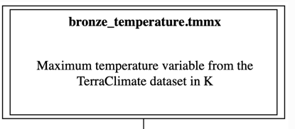

# Tutorial: Constructing data dictionaries and lineage graphs

This tutorial demonstrates how to construct a data dictionary and 
lineage graph for a climate analysis workflow built in the 
[Building a workflow](building-climate-pipeline.md) Tutorial.

```{seealso}
[Document a workflow](documenting-a-workflow.md)


[The Data Dictionary Generation tool](../../members/domain_dictionary.rst)
```

```{contents}
---
local:
---
```

## What we can generate

Dorieh provides an integrated dictionary and lineage utility that 
analyzes your workflow and domain definition file (such as 
example1_model.yml) to automatically generate 
a full suite of human-and machine-readable documentation with a comprehensive data 
dictionary along with graphical lineage diagrams — both at the table 
and the column level.     

The content of example1_model.yml

:::{toggle} Expand Code Block
```{literalinclude} example1_model.yml
:linenos:
:language: yaml
```
:::

The data dictionary and lineage tools extract and synthesize information from both your workflow and data model to provide:

* **A main table-level lineage diagram**
  * Visualizes the sequence of transformations and dependencies among all tables in your pipeline (Bronze, Silver, Gold, etc.)
  * Can use a variety of graphical formats: png, gif, ps2, svg, cmapx, jpeg
  * Interactive SVG format: If SVG is selected, each table node is clickable, linking directly to its detailed documentation
* **Table documentation pages**
  * Human-readable descriptions (drawn from YAML comments in your data model)
  * The SQL or DDL used to create the table
  * A summary of columns for the table, each with a link to its own detailed description
* **Column documentation pages**
* Human-readable description for the column
  * A column-level lineage diagram that shows exactly which upstream columns and tables contributed data to the current column
  * Interactive SVG: All elements are clickable, supporting rapid navigation
* **An index/glossary of all columns across all tables**
  * Tracks column propagation and transformation through the pipeline—a powerful tool for auditing or code review, especially in complex medallion architectures where columns may be re-used or re-named across layers
 

## Output Formats and Modes                

**Markdown** (.md) is generated by default; these can be browsed 
directly or easily converted to HTML for rich, interactive 
documentation.   

Other export formats such as YAML, Open Biological and Biomedical 
Ontologies (OBO) are supported for interoperability with downstream 
systems.  

The tool supports two modes:

* **Standalone**: Produce self-contained HTML (via Pandoc)—ideal for 
  documentation, archiving, or sharing with external parties. 
* **Sphinx**: Seamless integration into team or lab-wide Sphinx 
  documentation systems. 

## Running the tool

We will be using the 
[Data Dictionary Generation tool](../../members/domain_dictionary.rst).


Run the following commands to produce draft documentation:

```shell
cd docs
python -m dorieh.platform.dictionary.domain_dictionary ../example1_model.yml --fmt svg --lod min -o example1.dot --mode standalone
```

This command produces both Markdown and standalone HTML files that
can be easily examined.

:::{important}
If you plan to build documentation with Sphinx and MyST, instead run:
```shell
cd docs
python -m dorieh.platform.dictionary.domain_dictionary ../example1_model.yml --fmt svg --lod min -o example1.dot --mode sphinx
```
:::

## Exploring the Artifacts

Start with the 
[high-level lineage DAG](mddocs/example1.dot.md), where each 
node is a table. If you use Standalone (HTML) mode, open the generated 
`example1.dot.html` file in a browser. 

Click a table to view its documentation, including all columns and 
their descriptions.

Click on a column name to access its detail page—showing a 
column-level lineage diagram for tracing value origins 
across the workflow.  

All navigation is cross-linked for rapid provenance discovery.
                       
## Enriching the Data Dictionary
                                                
As mentioned above, the data dictionary tool automatically extracts 
any code (Python, SQL, DDL) that is used to create tables and columns.

For example, you can see **SQL/DDL block** in the generated page for the 
table [silver_temperature](mddocs/tables/silver_temperature.md) or 
**compute code** for columns `silver_temperature.temperature_in_F`
and `gold_temperature_by_state.t_mean_in_F` in the 
[column lineage diagram](mddocs/tables/gold_temperature_by_state/t_mean_in_f.md)

To make the documentation more comprehensive, the data modeling 
language supports the following keys: 

* **description**:  Verbose description
* **reference**: URL with external documentation
                                                        
For the following elements:

* [Domain](../../Datamodels.md#domain) 
* [Table](../../Datamodels.md#table) 
* [Column](../../Datamodels.md#column)

Additionally, **description** is supported for the
[Invalid Record](../../Datamodels.md#invalid-record) element.
                                             
An example of using these keys is shown below:

```yaml
      columns:
        - tmmx:
            type: float
            description: Maximum temperature variable from the TerraClimate dataset in K
            reference: https://developers.google.com/earth-engine/datasets/catalog/IDAHO_EPSCOR_GRIDMET#bands
```

See how this is reflected in the 
[generated documentation](mddocs/tables/bronze_temperature/tmmx.md):

```{note}
|                               |                        |
| ----------------------------- | ---------------------- |
| Table                         | [bronze_temperature](../bronze_temperature.md)           |
| Qualified name                | bronze_temperature.tmmx  |
| Datatype                      | float        |
| Reference | [https://developers.google.com/earth-engine/datasets/catalog/IDAHO_EPSCOR_GRIDMET#bands](https://developers.google.com/earth-engine/datasets/catalog/IDAHO_EPSCOR_GRIDMET#bands) |


Maximum temperature variable from the TerraClimate dataset in K
```

And in the 
[lineage graph]()



## Lineage Diagram for Medicare data

To view the full lineage diagram for the Medicare data, 
see [Medicare Data Dictionary](../../MedicareLineage.md).


