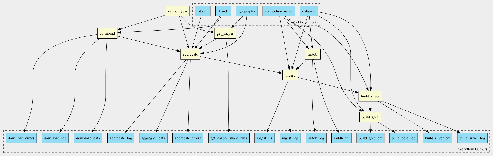

# Tutorial: Documenting a workflow

This tutorial walks through the process of documenting a workflow 
created in the
[Building a workflow](building-climate-pipeline.md) 
Tutorial.

```{seealso}
[Construct Data dictionaries and lineage graphs](constructing-lineage.md)
```

```{contents}
---
local:
---
```

## Workflow files

In the [previous tutorial](building-climate-pipeline.md) we built a 
workflow represented by two YAML files:

1. Workflow topology expressed in CWL: [example1.cwl](example1.cwl)
2. Description of the transformations performed by the workflow, 
   expressed in Dorieh Data Modeling DSL: [example1_model.yml](example1_model.yml)

We will now create online interactive documentation for the 
workflow. Dorieh includes a few helper  
[documentation utilities](../../docutils.md) that will help us with 
this process.

## Generating skeleton documentation
        
To generate a skeleton, we will use the 
[cwl2md](../../members/cwl2md.rst) 
utility that turns a CWL workflow into 
Markdown documentation with a DAG diagram and step descriptions.          

From the tutorial directory, run:

```shell
cwl2md -i example1.cwl -v -o docs/
```

The utility produces three files:

* **example1.md**: The [principal documentation file](mddocs/example1.md), containing: 
  * A visual representation of the workflow DAG (see Figure 1)
  * Description of all workflow inputs and outputs.
  * Description of all workflow steps. These step-by-step details 
    are accompanied by links to individual tool documentation. For 
    built-in Dorieh tools, links point to their online documentation;
    for custom tools, links may point to referenced CWL tools, 
    Python module docs, or relevant shell commands.    
  * A reference to the workflow's source code.
* The image file **example1.png**, which is embedded in the 
  **example1.md** file. 
* **example1cwl_src.md**: a Markdown file that wraps the workflow 
  [source code](mddocs/example1cwl_src.md) with syntax highlighting.



By default, the generated documentation includes topology, parameter 
types, and structural information. However, for effective 
collaboration and regulatory conformance, more thorough 
documentation is often needed.   

## Enhancing workflow documentation
                                   
### Adding Workflow Title

A top‑level title at the top of example1.cwl using a triple-hash 
header (###). This follows YAML conventions and provides a clear 
overview in the documentation output.  

```yaml
#!/usr/bin/env cwl-runner

### Sample Dorieh CWL workflow illustrating data acquisition, preparation, ingestion and transformation, using climate data

cwlVersion: v1.2
class: Workflow
#...
```

### Documenting workflow elements with `doc` key

It is recommended to add a `doc` key to all workflow elements, 
including inputs, outputs, steps. This provides a clear 
description of the purpose of each element and is supported by 
Dorieh utilities, resulting in more comprehensive and 
self-explanatory documentation.

For example, we can add a `doc` key to the `band` input:

```yaml
band:
    type: string
    default: tmmx
    doc: |
      University of Idaho Gridded Surface Meteorological Dataset 
      [bands](https://developers.google.com/earth-engine/datasets/catalog/IDAHO_EPSCOR_GRIDMET#bands)
```

Similarly, we can document `get_shapes` step:

```yaml
get_shapes:
    run: https://raw.githubusercontent.com/ForomePlatform/dorieh/main/src/cwl/get_shapes.cwl
    doc: |
      This step downloads Shape files from a given collection (TIGER/Line or GENZ) 
      and a geography (ZCTA or Counties) from the US Census website,
      for a given year or for the closest one.

    in:
      year:
        valueFrom: $(inputs.date.split('-')[0])
      geo: geography
      date: date
```

After adding or modifying `doc` entries, simply re-run:

```shell
cwl2md -i example1.cwl -v -o docs/
```

All documentation elements you include in your CWL workflow are 
incorporated into the auto-generated Markdown. This approach ensures 
both standardized and custom documentation are available together, 
supporting both technical reference and compliance requirements.   

A fully documented workflow is available 
[in the GitHub example](../../climate-examplecwl_src.md).

